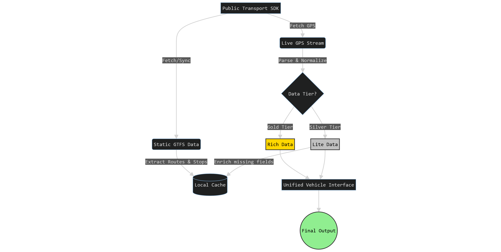

[](https://www.buymeacoffee.com/gmacev)

# lt-public-transport-sdk

A robust, type-safe TypeScript SDK for accessing **real-time public transport data** in Lithuanian cities.

It handles the complexity of parsing raw GPS streams (HTML/CSV), normalizing coordinate formats, handling text encodings (Windows-1257), and merging live data with static GTFS schedules (routes, stops).

## 🚀 Why use this SDK?

Raw public transport data in Lithuania (from stops.lt) is fragmented and messy:

- **Inconsistent Formats**: Vilnius uses 18 CSV columns, Kaunas uses 14, Panevėžys uses 9 (with no header).
- **Weird Encodings**: Data is often in `windows-1257` or mixed encodings.
- **Weird Coordinates**: Some cities provide WGS84, others provide integers divided by 1,000,000.
- **Sparse Data**: GPS streams often lack route names or destinations, requiring lookup against GTFS data.

**This SDK solves all of that.** It provides a **single, unified `Vehicle` interface** regardless of the city or underlying data format.

## ✨ Features

- **Unified API**: One method (`getVehicles`) validates and normalizes data for all supported cities.
- **Auto-Enrichment**: optional automatic merging of live GPS data with GTFS routes (adds `destination`, `tripId`).
- **Extensible**: Add custom cities or override existing configurations without waiting for SDK updates.
- **Resilience**: Robust error handling for network timeouts, stale data, and malformed responses.
- **Type-Safe**: Built with TypeScript and Zod for runtime validation.

## 📦 Installation

```bash
npm install lt-public-transport-sdk
```

## ⚡ Quick Start

```typescript
import { LtTransport } from "lt-public-transport-sdk";

// 1. Initialize the client
const client = new LtTransport({
  autoEnrich: true, // Automatically download GTFS and match routes
  cacheDir: "./.cache", // Where to store GTFS/ZIP files
});

async function main() {
  try {
    // 2. Get real-time vehicles for Vilnius
    console.log("Fetching Vilnius buses...");
    const vehicles = await client.getVehicles("vilnius");

    console.log(`Found ${vehicles.length} active vehicles:`);

    vehicles.slice(0, 3).forEach((v) => {
      console.log(`🚌 [${v.route}] ${v.vehicleNumber} -> ${v.destination}`);
      console.log(`   📍 ${v.latitude}, ${v.longitude} (${v.speed} km/h)`);
    });
  } catch (err) {
    console.error("Error fetching data:", err);
  }
}

main();
```

## 🏙️ Supported Cities

| City             | Tier      | GPS Data | GTFS Data | Formats Handled                        |
| ---------------- | --------- | -------- | --------- | -------------------------------------- |
| **Vilnius**      | 🥇 Gold   | ✅ Full  | ✅ Yes    | 18-col CSV, GTFS lookup                |
| **Kaunas**       | 🥇 Gold   | ✅ Full  | ✅ Yes    | 14-col CSV, Trip/Stop matching         |
| **Klaipėda**     | 🥇 Gold   | ✅ Full  | ✅ Yes    | 12-col CSV                             |
| **Alytus**       | 🥇 Gold   | ✅ Full  | ✅ Yes    | 13-col CSV                             |
| **Druskininkai** | 🥇 Gold   | ✅ Full  | ✅ Yes    | 13-col CSV                             |
| **Panevėžys**    | 🥈 Silver | ✅ Lite  | ✅ Yes    | 9-col (no header), Integer coords      |
| **Tauragė**      | 🥈 Silver | ✅ Lite  | ✅ Yes    | 8-col (no header), Alphanumeric routes |
| **Šiauliai**     | 🥉 Bronze | ❌ No    | ✅ Yes    | GTFS only                              |
| **Utena**        | 🥉 Bronze | ❌ No    | ✅ Yes    | GTFS only                              |

## 🧩 How It Works



> **Note**: Bronze tier cities (Šiauliai, Utena) do not publish real-time GPS data. Calling `getVehicles()` will throw a `GpsNotAvailableError`, but `getRoutes()` and `getStops()` **work normally** with GTFS data.

### `LtTransport` Class

#### Configuration

```typescript
const client = new LtTransport({
  // Directory to store downloaded GTFS zip files (default: os.tmpdir())
  cacheDir: "./cache",

  // Max age of GPS data to consider "live" (default: 5 minutes)
  staleThresholdMs: 5 * 60 * 1000,

  // Filter out vehicles that haven't updated recently (default: false)
  filterStale: true,

  // Fetch and parse GTFS to add destination/route info (default: true)
  autoEnrich: true,

  // Filter out coordinates outside Lithuania (default: true)
  filterInvalidCoords: true,

  // Request timeout in ms (default: 10000)
  requestTimeout: 10000,
});
```

#### Extensibility: Custom Cities & Overrides

The SDK supports adding new cities or overriding existing configurations **without waiting for SDK updates**:

```typescript
import { LtTransport, type CityConfig } from "lt-public-transport-sdk";

const client = new LtTransport({
  // Add a completely new city
  customCities: {
    marijampole: {
      id: "marijampole",
      tier: "silver",
      gps: {
        enabled: true,
        format: "lite",
        url: "https://www.stops.lt/marijampole/gps.txt",
      },
      gtfs: {
        enabled: true,
        url: "https://www.stops.lt/marijampole/marijampole/gtfs.zip",
      },
      // Required for 'lite' format: define column indices
      liteFormat: {
        minColumns: 9,
        vehicleIdIndex: 7,
        routeIndex: 1,
        coordIndices: [3, 2], // [latIndex, lonIndex]
        speedIndex: 4,
        bearingIndex: 5,
      },
    },
  },

  // Override existing city config (e.g., if format changed)
  cityOverrides: {
    panevezys: {
      liteFormat: {
        minColumns: 10, // They added a column
        vehicleIdIndex: 8,
        routeIndex: 1,
        coordIndices: [3, 2],
        speedIndex: 4,
        bearingIndex: 5,
      },
    },
  },
});

// Custom cities work with all methods
const vehicles = await client.getVehicles("marijampole");
const cities = client.getCities(); // includes 'marijampole'
```

> **Note**: Invalid configurations throw helpful `ZodError` messages explaining what's wrong.

#### Methods

#### Methods

| Method                       | Returns                              | Description                                                                                              |
| ---------------------------- | ------------------------------------ | -------------------------------------------------------------------------------------------------------- |
| **`getVehicles(city)`**      | `Promise<Vehicle[]>`                 | Fetches real-time vehicle positions. If `autoEnrich` is true, ensures GTFS data is synced and merges it. |
| **`sync(city, force?)`**     | `Promise<SyncResult>`                | Manually downloads/updates GTFS static data (routes/stops). Throttled to 60s unless `force=true`.        |
| **`getRoutes(city)`**        | `Promise<Route[]>`                   | Returns the list of static routes from GTFS. Requires prior `sync()`.                                    |
| **`getStops(city)`**         | `Promise<Stop[]>`                    | Returns the list of static stops from GTFS. Requires prior `sync()`.                                     |
| **`getTrips(city)`**         | `Promise<Trip[]>`                    | Returns all trips with route/service/shape linkage. Requires prior `sync()`.                             |
| **`getShapes(city)`**        | `Promise<Map<string, ShapePoint[]>>` | Returns route polylines grouped by shape ID. Requires prior `sync()`.                                    |
| **`getCalendar(city)`**      | `Promise<Calendar[]>`                | Returns service calendars (which days services operate). Requires prior `sync()`.                        |
| **`getCalendarDates(city)`** | `Promise<CalendarDate[]>`            | Returns calendar exceptions (holidays, special dates). Requires prior `sync()`.                          |
| **`getAgencies(city)`**      | `Promise<Agency[]>`                  | Returns transit agency information. Requires prior `sync()`.                                             |
| **`getSchedule(city)`**      | `Promise<Map<string, StopTime[]>>`   | Returns stop times grouped by trip ID (⚠️ large dataset). Requires prior `sync()`.                       |
| **`getCities()`**            | `CityId[]`                           | Returns a list of all supported city identifiers.                                                        |
| **`getCityConfig(city)`**    | `CityConfig`                         | Returns configuration details (tier, URLs) for a specific city.                                          |

### Key Types

#### `Vehicle`

```typescript
interface Vehicle {
  /** Unique identifier (e.g. "vilnius-1234") */
  readonly id: string;

  /** Vehicle number visible on the bus/trolley */
  readonly vehicleNumber: string;

  /** Route number (e.g. "3G", "10") */
  readonly route: string;

  /** Type of vehicle */
  readonly type: "bus" | "trolleybus" | "ferry" | "unknown";

  /** Latitude in WGS84 decimal degrees */
  readonly latitude: number;

  /** Longitude in WGS84 decimal degrees */
  readonly longitude: number;

  /** Bearing in degrees (0-360) */
  readonly bearing: number;

  /** Speed in km/h */
  readonly speed: number;

  /** Destination name (e.g. "Santariškės") */
  readonly destination: string | null;

  /** Delay in seconds (positive = late, negative = early) */
  readonly delaySeconds: number | null;

  /** Trip identifier from source system */
  readonly tripId: string | null;

  /** GTFS trip reference (Vilnius only) */
  readonly gtfsTripId: string | null;

  /** Whether data is older than staleThreshold */
  readonly isStale: boolean;

  /** When the position was measured */
  readonly measuredAt: Date;
}
```

#### `Route` (GTFS)

```typescript
interface Route {
  /** Unique route ID (e.g. "routes_123") */
  readonly id: string;

  /** Short name (e.g. "3G") */
  readonly shortName: string;

  /** Long name (e.g. "Oro uostas - Centras - Fabijoniškės") */
  readonly longName: string;

  /** Transport type */
  readonly type: VehicleType;

  /** Route color (hex without #) */
  readonly color: string;

  /** Text color (hex without #) */
  readonly textColor: string;
}
```

#### `Stop` (GTFS)

```typescript
interface Stop {
  /** Unique stop ID */
  readonly id: string;

  /** Check digit code (if available) */
  readonly code: string | null;

  /** Stop name */
  readonly name: string;

  /** Stop description/details */
  readonly description: string | null;

  /** Latitude */
  readonly latitude: number;

  /** Longitude */
  readonly longitude: number;
}
```

#### `Trip` (GTFS)

```typescript
interface Trip {
  /** Unique trip ID */
  readonly id: string;

  /** Route ID reference */
  readonly routeId: string;

  /** Service/calendar ID */
  readonly serviceId: string;

  /** Trip destination headsign */
  readonly headsign: string;

  /** Trip short name (optional) */
  readonly shortName: string | null;

  /** Direction (0 or 1) */
  readonly directionId: number | null;

  /** Shape ID reference (for drawing route path) */
  readonly shapeId: string | null;
}
```

#### `ShapePoint` (GTFS)

```typescript
interface ShapePoint {
  /** Shape ID */
  readonly shapeId: string;

  /** Latitude */
  readonly latitude: number;

  /** Longitude */
  readonly longitude: number;

  /** Point sequence in shape */
  readonly sequence: number;

  /** Distance traveled along shape (optional) */
  readonly distanceTraveled: number | null;
}
```

#### `Calendar` (GTFS)

```typescript
interface Calendar {
  /** Service ID */
  readonly serviceId: string;

  /** Operates on Mondays */
  readonly monday: boolean;

  /** Operates on Tuesdays */
  readonly tuesday: boolean;

  /** Operates on Wednesdays */
  readonly wednesday: boolean;

  /** Operates on Thursdays */
  readonly thursday: boolean;

  /** Operates on Fridays */
  readonly friday: boolean;

  /** Operates on Saturdays */
  readonly saturday: boolean;

  /** Operates on Sundays */
  readonly sunday: boolean;

  /** Service start date (ISO format YYYY-MM-DD) */
  readonly startDate: string;

  /** Service end date (ISO format YYYY-MM-DD) */
  readonly endDate: string;
}
```

#### `CalendarDate` (GTFS)

```typescript
interface CalendarDate {
  /** Service ID */
  readonly serviceId: string;

  /** Exception date (ISO format YYYY-MM-DD) */
  readonly date: string;

  /** Exception type */
  readonly exceptionType: "added" | "removed";
}
```

#### `Agency` (GTFS)

```typescript
interface Agency {
  /** Agency ID (optional if only one agency) */
  readonly id: string | null;

  /** Agency name */
  readonly name: string;

  /** Agency website URL */
  readonly url: string;

  /** Agency timezone */
  readonly timezone: string;

  /** Agency language code */
  readonly language: string | null;

  /** Agency phone number */
  readonly phone: string | null;
}
```

#### `StopTime` (GTFS)

```typescript
interface StopTime {
  /** Trip ID */
  readonly tripId: string;

  /** Stop ID */
  readonly stopId: string;

  /** Arrival time (HH:MM:SS format, may exceed 24:00:00) */
  readonly arrivalTime: string;

  /** Departure time (HH:MM:SS format, may exceed 24:00:00) */
  readonly departureTime: string;

  /** Stop sequence (0-based) */
  readonly sequence: number;

  /** Stop headsign override */
  readonly stopHeadsign: string | null;

  /** Pickup type (0=regular, 1=none, etc.) */
  readonly pickupType: number | null;

  /** Drop-off type (0=regular, 1=none, etc.) */
  readonly dropOffType: number | null;
}
```

## 💾 Caching & Best Practices

By default, GTFS data (routes & stops) is cached in your system's temporary directory (`os.tmpdir()/lt-transport-sdk-cache`).

### Microservices / Docker

If you are running in a containerized environment (Docker, Kubernetes), it is recommended to:

1.  **Persist the cache**: Mount a volume to avoid re-downloading GTFS data (5-10MB) on every container restart.
2.  **Configure path**: Set `cacheDir` to your mounted volume.

```typescript
const client = new LtTransport({
  cacheDir: "/data/cache", // Mount a volume here
});
```

### Serverless (AWS Lambda, etc.)

The SDK works in serverless environments by writing to `/tmp`. Note that "cold starts" will incur a latency penalty while GTFS data is downloaded and parsed.

## ⚠️ Error Handling

The SDK throws specific errors you can catch:

```typescript
import {
  GpsNotAvailableError, // City doesn't support GPS
  InvalidCityError, // Typo in city name
  SyncRequiredError, // Need to run syncGtfs() (if autoEnrich: false)
  TransportNetworkError, // Network timeout/failure
} from "lt-public-transport-sdk/errors";

try {
  await client.getVehicles("unknown-city");
} catch (err) {
  if (err instanceof InvalidCityError) {
    console.log("Invalid city ID!");
  }
}
```

## 🛠️ Development & Testing

This project uses **Vitest** for testing and **TypeScript** for building.

```bash
# Install dependencies
npm install

# Run unit tests (fast, using fixtures)
npm test

# Run integration tests (hits live APIs - verify functionality)
npm run build
npm run test:integration
```

## 📄 License

MIT

## Support

If you found this SDK useful for your project, consider buying me a coffee! It helps me keep the reverse-engineering efforts going.

<a href="https://www.buymeacoffee.com/gmacev" target="_blank"></a>